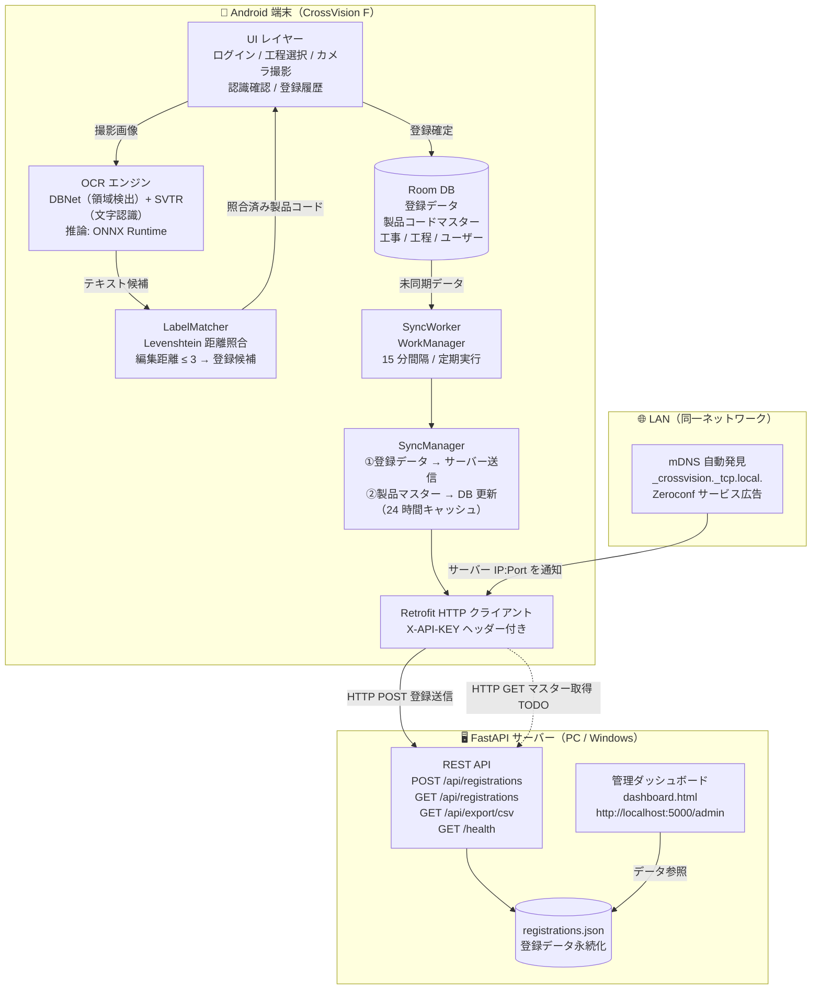

# CrossVision F — 鉄骨文字認識アプリ

> **GroupA 開発** | 鉄骨工程管理システムの Android アプリケーション

鉄骨製品に刻印された製品番号をカメラで撮影し、AI（PaddleOCR）で自動認識・工程登録するシステムです。  
認識した製品コードはサーバーへリアルタイム送信され、オフライン時も端末に保存してオンライン復帰時に自動同期します。

## リポジトリ

| リポジトリ | ブランチ | 役割 |
|---|---|---|
| [iput04-isono/sevenstar](https://github.com/iput04-isono/sevenstar) | `main` | GroupA 開発リポジトリ（主作業場所） |
| [iput04-isono/Solution](https://github.com/iput04-isono/Solution) | `prototype` | チーム統合ブランチ（リリース相当） |
| [iput04-isono/Solution](https://github.com/iput04-isono/Solution) | `prototype_Ver2.0` | prototype の Ver2.0 スナップショット |

---

## システム構成



### 構成の補足

| コンポーネント | 技術 | 説明 |
|---|---|---|
| OCR 領域検出 | DBNet / `det.onnx` | 刻印文字の領域を多角形で検出（PP-OCRv4） |
| OCR 文字認識 | SVTR / `ppocr_rec.onnx` | 検出領域から文字列を読み取り（PP-OCRv4） |
| 照合エンジン | Levenshtein 距離 | OCR 誤認識を許容しながら製品コードを照合 |
| ローカル DB | Room（SQLite） | 登録データ＋製品コードマスター（v2 で `product_labels` テーブル追加） |
| バックグラウンド同期 | WorkManager | オンライン時に 15 分間隔で自動実行 |
| サーバー自動発見 | Zeroconf / mDNS | IP 手入力なしでアプリがサーバーを自動検出 |
| バックエンドサーバー | FastAPI（Python） | 登録受信・CSV 出力・管理ダッシュボードを提供 |

---

## 動作確認済み環境


| 項目 | バージョン / 内容 |
|---|---|
| Android Studio | Hedgehog 以降推奨 |
| JDK | 17 以上 |
| Kotlin | 1.9.24 |
| compileSdk | 35 |
| minSdk | 24（Android 7.0 以上） |
| 実機テスト端末 | Samsung Galaxy S20 Ultra（Android 13） |

---

## セットアップ手順（初回のみ）

### Step 1. リポジトリを取得

```bash
# GroupA 開発リポジトリ（推奨）
git clone https://github.com/iput04-isono/sevenstar.git
cd sevenstar

# チーム統合リポジトリから取得する場合
git clone -b prototype https://github.com/iput04-isono/Solution.git
cd Solution
```

### Step 2. Android Studio で開く

1. Android Studio を起動
2. `File → Open` で `Solution` フォルダを選択
3. Gradle Sync が自動で始まります（`Sync Now` を押す）

> Sync が始まらない場合は `File → Sync Project with Gradle Files`

### Step 3. エミュレーターを使う場合（実機なしで試したい場合）

**AVD（仮想デバイス）の作成：**

1. Android Studio の `Tools → Device Manager` を開く
2. `Create Device` をクリック
3. 以下の設定を推奨：

| 項目 | 推奨値 |
|---|---|
| デバイス | Pixel 6（または任意） |
| System Image | **x86_64** の API 28 以上（例：API 34） |
| RAM | **4096 MB 以上**（OCR モデルが大きいため） |
| Internal Storage | 4096 MB 以上 |

> ⚠️ **注意**：x86_64 イメージを選んでください。arm64 イメージはエミュレーターでの動作が遅くなります。

4. `Finish` でデバイスを作成
5. Device Manager の ▶ ボタンでエミュレーターを起動

**エミュレーターでのカメラ画像テスト：**

エミュレーターはカメラが仮想（チェッカー柄など）のため、実際の鉄骨画像で認識テストをするには **ギャラリーから画像を選択** してください。

```
テスト画像を端末に転送する方法：
  1. エミュレーターの「...（拡張コントロール）」→「Camera」でバーチャルシーンを変更、
     または
  2. エミュレーターのウィンドウにファイルをドラッグ＆ドロップ
     → フォトアプリのギャラリーに追加されます
```

---

### Step 4. USB デバッグを有効にする（実機テストの場合）

1. スマートフォンの `設定 → 端末情報 → ビルド番号` を 7 回タップ  
   → 「開発者向けオプション」が有効になります
2. `設定 → 開発者向けオプション → USB デバッグ` をオン
3. USB ケーブルで PC に接続し、スマートフォン側で「接続を許可」を選択

> **Windows の場合**：Samsung 端末は [Samsung USB Driver](https://developer.samsung.com/mobile/android-usb-driver.html) の別途インストールが必要です

### Step 5. ビルド＆インストール

**Android Studio から実行する場合：**

1. 上部のデバイス選択プルダウンで接続した実機を選択
2. ▶ ボタン（Run）を押す

**コマンドラインから実行する場合：**

```bash
# Windows
.\gradlew.bat installDebug

# Mac / Linux
./gradlew installDebug
```

---

## サーバー（バックエンド）のセットアップ

本プロジェクトは **FastAPI** ベースの管理サーバーを同梱しています。Android アプリからのデータ受信、CSV 書き出し、リアルタイムダッシュボードを提供します。

### Step 5. サーバーの起動

1. Python 3.10 以上がインストールされていることを確認
2. 依存ライブラリのインストール:
   ```bash
   cd server
   pip install -r requirements.txt
   ```
3. サーバー起動:
   ```bash
   # ポート 5000 で起動（Android アプリのデフォルト接続先）
   python main.py
   # または
   uvicorn main:app --host 0.0.0.0 --port 5000 --reload
   ```

### サーバーの主要機能

| 機能 | 説明 |
|---|---|
| **自動発見 (mDNS/Zeroconf)** | 起動と同時に `_crossvision._tcp.local.` でサービスを広告。アプリが IP アドレス不要で自動接続 |
| **管理ダッシュボード** | `http://localhost:5000/admin` でリアルタイムに登録状況を確認 |
| **API キー認証** | `X-API-KEY: cvf_7s_9922_zrkp_8x11` ヘッダーによる認証 |
| **CSV エクスポート** | `GET /api/export/csv` で Excel 対応の CSV をダウンロード |

### サーバー API エンドポイント一覧

| メソッド | パス | 説明 | 認証 |
|---|---|---|---|
| `POST` | `/api/registrations` | 登録データ受信・保存 | ✅ 必要 |
| `GET` | `/api/registrations` | 登録データ一覧取得 | ❌ 不要 |
| `GET` | `/api/export/csv` | CSV ダウンロード | ❌ 不要 |
| `GET` | `/health` | サーバー死活確認 | ❌ 不要 |
| `GET` | `/admin` | 管理ダッシュボード | ❌ 不要 |

---

## アプリの使い方

### ログイン

アプリ起動後、以下のいずれかでログインしてください。

| ユーザー ID | パスワード | 権限 |
|---|---|---|
| `admin` | `admin123` | 管理者 |
| `user01` | `pass01` | 作業員 |
| `user02` | `pass02` | 作業員 |

### 撮影・文字認識

1. **工事・工程を選択**してから認識画面へ進む
2. **カメラ** または **ギャラリー** から画像を選択
3. 認識結果確認画面で以下を確認：

```
┌───────────────────────────────┐
│  認識領域オーバーレイ画像       │  ← どの文字を読んだか視覚的に確認
│  （緑:高信頼度 / 赤:低信頼度）  │
├───────────────────────────────┤
│  【登録候補】                   │  ← 正解ラベルと一致（編集距離 ≤ 3）
│  ✓ B1Sb30N-7A  (距離:1, 82%)  │
│  ✓ H150x150x7  (完全一致, 91%)│
├───────────────────────────────┤
│  参考：一致しなかった認識結果    │  ← 距離 > 3（登録されません）
│  ・AB3CX  (信頼度:45%)         │
└───────────────────────────────┘
```

3. 認識結果確認画面で内容を確認し、「登録」ボタンを押す

### UI の便利な機能

- **再読み込み（同期）**: カテゴリ選択の横にある 🔄 アイコンをタップすると、最新のマスターデータを手動で再読み込みします。
- **ログアウト**: 🚪 アイコンからログイン画面に戻れます。
- **自動同期**: ネットワークが不安定な場所で登録しても、オンライン復帰時にバックグラウンドで自動送信されます（WorkManager による 15 分間隔の定期同期）。
- **製品コード自動更新**: サーバーの最新製品コードリストを 24 時間ごとに自動取得し、ローカル DB を更新します。

---

## OCR モデルファイルについて

以下のファイルが `app/src/main/assets/` に含まれています（追加作業不要）。

| ファイル | 内容 |
|---|---|
| `det.onnx` | テキスト領域検出モデル（PP-OCRv4 DBNet） |
| `ppocr_rec.onnx` | 文字認識モデル（PP-OCRv4 SVTR mobile） |
| `dict.txt` | 認識文字辞書 |
| `product_labels.txt` | 製品コードマスター初期データ（1017 件）。アプリ起動後はサーバー同期で Room DB に保存され、DB が優先して使われる |

> ⚠️ `det.onnx` は 83MB のため、GitHub の推奨上限（50MB）を超えています。  
> Git Large File Storage（LFS）への移行を今後検討してください。

---

## 文字認識技術の詳細

本アプリが採用している AI 文字認識（OCR）の処理フローと、各ステップで用いている技術を解説します。

### 処理フロー全体

```
[カメラ / ギャラリー画像]
        │
        ▼
① 画像前処理（ImagePreprocessor）
  　長辺を 1280px にリサイズ・コントラスト強調
        │
        ▼
② テキスト領域検出（OcrEngine ― DBNet）
  　ニューラルネットで文字のある確率マップを生成
  　→ BFS で連結成分を抽出 → 多角形（ポリゴン）として領域を確定
        │
        ▼
③ 文字認識（OcrEngine ― SVTR）
  　各領域を切り出し → 正立・180° 回転の両方を認識
  　→ ラベル照合結果が良い方の向きを採用
        │
        ▼
④ ラベルマッチング（LabelMatcher）
  　認識テキストと製品コードマスター（Room DB 優先 / assets フォールバック）を比較
  　→ 編集距離 ≤ 3 なら「登録候補」、4 以上なら「参考」に分類
        │
        ▼
⑤ 結果表示（ConfirmActivity）
  　オーバーレイ画像 ＋ 登録候補 ＋ 参考一覧を表示
```

---

### ① 画像前処理

| 処理 | 内容 |
|---|---|
| **リサイズ** | 長辺を最大 1280px に統一。短辺は縦横比を維持してスケール |
| **コントラスト強調** | 屋外・逆光環境での刻印文字の視認性を改善 |
| **EXIF 回転補正** | スマートフォンのカメラは向きを EXIF タグで記録する。このタグを読み取り、画像を正しい向きに回転させてから認識に渡す |

> **ポイント**：スマートフォンのカメラ画像は「保存時に向きを回転させず EXIF に記録する」仕様のため、EXIF を無視すると 90° 回転した状態で認識されてしまう。本アプリではこれを自動補正している。

---

### ② テキスト領域検出（DBNet）

#### DBNet とは

**DBNet（Differentiable Binarization Network）** は、中国の AI 研究機関 Baidu が開発した **PaddleOCR** に含まれるテキスト検出モデルです。

通常の二値化（白黒化）では固定の閾値を使うのに対し、DBNet は「**どのピクセルが文字領域か**」を表す確率マップを **ニューラルネットワーク自身が学習**します。この確率マップを使って、斜め・湾曲した文字にも対応できる **多角形（ポリゴン）** として領域を切り出します。

```
入力画像 → [DBNet モデル（det.onnx）] → 確率マップ（0.0〜1.0）
                                              │
                                  閾値以上のピクセルを BFS で連結
                                              │
                                    連結成分ごとに多角形を生成
                                              │
                                    UNCLIP で領域を少し広げる
                                              │
                                    切り取り済みのテキスト領域群
```

#### 主要パラメータ

| パラメータ | 値 | 意味 |
|---|---|---|
| `DET_SIZE` | 960px | モデルへ入力する画像サイズ |
| `DET_THRESHOLD` | 0.28 | 確率マップの閾値（低いほど小さな文字を拾いやすい） |
| `BFS_MIN_PX` | 25px | 連結成分の最小ピクセル数（雑音除去） |
| `MIN_POLY_AREA` | 100px² | 有効な領域の最小面積（極小の誤検出を除外） |
| `UNCLIP_RATIO` | 2.0 | 検出した領域を広げる比率（文字の端が切れないように） |
| `MAX_REGIONS` | 12 | 1 枚の画像から処理する最大領域数 |

> **UNCLIP（領域の拡張）について**：DBNet が検出する領域は文字ギリギリに収まることが多い。`UNCLIP_RATIO` を大きくすることで認識精度が上がる一方、隣接する文字と混在するリスクがある。鉄骨の刻印は文字間隔が広いため、2.0 に設定している。

#### 多角形の切り出し（Perspective Crop）

多角形の4頂点を **射影変換（Perspective Transform）** で長方形に変換してから認識モデルへ渡します。Android の `Matrix.setPolyToPoly` を使用しています。

```
 ╱─────╲           ┌─────────┐
╱ 傾いた ╲  →変換→  │ 正面から │
╲ 文字領域╱         │ 見た文字 │
 ╲─────╱           └─────────┘
```

---

### ③ 文字認識（SVTR）

#### SVTR とは

**SVTR（Single Visual model for scene Text Recognition）** は、PaddleOCR に含まれる文字認識モデルです。検出された各テキスト領域から、実際の文字列を出力します。

- 入力：横長に正規化した領域画像（高さ 48px、幅は動的に変化）
- 出力：文字列と各文字の確信度（0.0〜1.0）

#### 回転対応（向き自動判定）

鉄骨の刻印は上下逆さまに読まれることがある。本アプリでは各領域に対して **正立** と **180° 回転** の 2 パターンを並列に認識し、**ラベルとの編集距離が小さい方** を採用します。

```kotlin
// 正立で認識 → LabelMatcher で距離を計算
val normalResult   = recognize(region)
val normalDist     = labelMatcher.findBest(normalResult.text).distance

// 180° 回転して認識 → 距離を計算
val rotatedResult  = recognize(rotate180(region))
val rotatedDist    = labelMatcher.findBest(rotatedResult.text).distance

// 距離が小さい方（正解に近い方）を最終結果とする
return if (rotatedDist < normalDist) rotatedResult else normalResult
```

---

### ④ ラベルマッチング（Levenshtein 距離）

> **データソース**：製品コードは Room DB（サーバー同期済み）を優先して読み込みます。DB が空の場合は `assets/product_labels.txt`（初期データ 1017 件）にフォールバックします。サーバー同期は WorkManager が 24 時間ごとにバックグラウンドで自動実行します。

#### 製品コードマスター同期フロー

```
[起動 / WorkManager 定期実行]
         │
         ▼
 ネットワーク確認 ── 未接続 ──→ スキップ（-1 を返す）
         │ 接続あり
         ▼
 前回同期から 24 時間以内？ ── YES ──→ スキップ（-1 を返す）
         │ NO
         ▼
 GET /api/product-labels でサーバーから取得
（現在はモック: assets/product_labels.txt を参照）
         │
         ▼
 product_labels テーブルを全削除 → 新リストを一括挿入
         │
         ▼
 LabelMatcher が DB から最新リストを読み込み
```

#### Levenshtein 距離（編集距離）とは

2 つの文字列の「**似ている度合い**」を数値化する方法です。  
「1 文字の追加・削除・置換」を何回行えば一方の文字列に変換できるかを距離として表します。

```
例）OCR 認識結果 "B1Sb30N-7B"
    正解ラベル    "B1Sb30N-7A"
    → 末尾 1 文字だけ異なる → 距離 = 1（1 回の置換）

例）OCR 認識結果 "H15OX15OX7"（O と 0 を混同）
    正解ラベル    "H150X150X7"
    → 2 文字の混同 → 距離 = 2
```

#### 判定ルール

| 編集距離 | 判定 | 表示 |
|---|---|---|
| 0（完全一致） | 登録候補 ◎ | 認識結果確認画面の上部 |
| 1〜3（近い一致） | 登録候補 ○ | 同上（正解ラベルを表示） |
| 4 以上（遠い） | 参考情報 | 画面下部の別枠に表示 |
| ラベルなし | 参考情報 | 同上 |

#### OCR 誤認識への対策（バリアント生成）

鉄骨刻印で混同しやすい文字ペアを事前に定義し、OCR 出力を正規化してから距離計算しています。

| OCR が間違えやすいパターン | 対応 |
|---|---|
| `0`（ゼロ）と `O`（英字オー） | 両方向に変換したバリアントを生成 |
| `1`（数字）と `I`（英字アイ） | 同上 |
| `5` と `S` | 同上 |
| `8` と `B` | 同上 |

---

### ⑤ 認識結果の可視化（オーバーレイ表示）

検出した各テキスト領域を元画像に色付きで重ねて表示することで、「どの文字を認識したか」を視覚的に確認できます。

| 色 | 意味（信頼度） |
|---|---|
| 緑 | 高信頼度（≥ 70%） |
| 黄 | 中信頼度（50〜70%） |
| 赤 | 低信頼度（< 50%） |

数字バッジ（①②③…）で結果リストとの対応を示しています。

---

## プロジェクト構成

```
app/src/main/java/com/crossvision/f/
├── data/
│   ├── local/
│   │   ├── AppDatabase.kt        # Room DB 定義（v2）・マイグレーション管理
│   │   ├── ProductLabelDao.kt    # 製品コードマスター DAO
│   │   ├── ConstructionDao.kt    # 工事データ DAO
│   │   ├── ProcessDao.kt         # 工程データ DAO
│   │   ├── RegistrationDao.kt    # 登録データ DAO
│   │   └── UserDao.kt            # ユーザーデータ DAO
│   ├── model/
│   │   ├── ProductLabel.kt       # 製品コードマスターエンティティ
│   │   ├── Construction.kt       # 工事エンティティ
│   │   ├── Process.kt            # 工程エンティティ
│   │   ├── Registration.kt       # 登録エンティティ
│   │   └── User.kt               # ユーザーエンティティ
│   └── repository/
│       └── AppRepository.kt      # DB ↔ UI の橋渡し（製品コード操作含む）
├── ocr/
│   ├── OcrEngine.kt              # PaddleOCR 推論（DBNet + SVTR）
│   ├── LabelMatcher.kt           # Levenshtein 距離によるラベル照合（DB 優先）
│   ├── OcrProcessor.kt           # 認識結果を登録候補 / 参考に分類
│   ├── OcrResult.kt              # 認識結果データクラス
│   ├── ProductCodeValidator.kt   # 製品コード形式バリデーション
│   └── ImagePreprocessor.kt      # リサイズ前処理（長辺 1280px）
├── sync/
│   ├── SyncWorker.kt             # WorkManager バックグラウンドタスク
│   └── SyncManager.kt            # 登録データ同期 + 製品コードマスター更新
├── ui/
│   ├── login/                    # ログイン画面
│   ├── process/                  # 工事・工程選択画面
│   ├── camera/                   # CameraX カメラ画面
│   ├── recognize/                # 画像選択・OCR 実行画面
│   ├── confirm/                  # 認識結果確認・登録画面
│   ├── register/                 # 登録完了画面
│   └── library/                  # 登録履歴一覧画面
└── CrossVisionApp.kt             # Application クラス（WorkManager 初期化）
```

**テスト・スクリプト：**

```
app/src/androidTest/java/com/crossvision/f/
└── ProductLabelSyncTest.kt  # 製品コード同期の実機インストゥルメンテッドテスト（5ケース）

scripts/
├── install_all.ps1          # 接続全デバイスへ一括インストール
└── test_label_sync.ps1      # 製品コード同期の自動テスト（PowerShell）

server/
├── main.py                  # 開発用ローカルサーバー（FastAPI）
└── requirements.txt         # Python 依存ライブラリ
```

---

## ブランチ運用ルール

```
[Solution リポジトリ]
prototype          ← 動作確認済みの統合ブランチ（リリース相当）
prototype_Ver2.0   ← prototype の Ver2.0 時点のスナップショット
prototype_develop  ← prototype への統合前の開発ブランチ
feature/*          ← 機能ごとの作業ブランチ

[sevenstar リポジトリ]
main               ← GroupA 主作業ブランチ（= Solution/prototype と同期）
```

### リポジトリ間の同期

```bash
# sevenstar の main に作業内容をプッシュ
git push origin main

# Solution/prototype にも同期（チームへの反映）
git push upstream main:prototype

# upstream（Solution）の最新を取り込む
git fetch upstream
git merge upstream/prototype
```

### 機能開発フロー

```bash
# 1. prototype_develop から作業ブランチを切る
git fetch upstream
git checkout -b feature/機能名 upstream/prototype_develop

# 2. 作業してコミット
git add .
git commit -m "feat: 機能の説明"

# 3. sevenstar へプッシュ → Solution へ PR
git push origin feature/機能名
# → PR: feature/機能名 → prototype_develop（Solution）
# → 動作確認後、prototype_develop → prototype へ PR
```

### コミットメッセージのルール

| プレフィックス | 用途 |
|---|---|
| `feat:` | 新機能追加 |
| `fix:` | バグ修正 |
| `docs:` | ドキュメント変更 |
| `refactor:` | リファクタリング |
| `test:` | テスト追加 |
| `chore:` | Gradle・設定変更 |

---

## 使用ライブラリ

| ライブラリ | バージョン | 用途 |
|---|---|---|
| androidx.core-ktx | 1.15.0 | Kotlin 拡張 |
| androidx.appcompat | 1.7.0 | 後方互換 UI |
| material | 1.12.0 | マテリアルデザイン |
| androidx.lifecycle | 2.8.7 | ViewModel / LiveData |
| Room | 2.6.1 | ローカル DB |
| CameraX | 1.3.4 | カメラ制御 |
| WorkManager | 2.9.1 | バックグラウンド同期 |
| Retrofit2 | 2.9.0 | HTTP 通信 |
| OkHttp | 4.12.0 | HTTP クライアント |
| ONNX Runtime Android | 1.17.1 | AI モデル推論（OCR） |
| Kotlinx Coroutines | 1.8.1 | 非同期処理 |

---

## 更新履歴

| バージョン | 日付 | 内容 |
|---|---|---|
| Ver 2.0 | 2026-04-24 | 製品コードマスターの Room DB 管理化・サーバー自動同期機能を統合（GroupA × チームメンバー機能マージ） |
| Ver 1.x | 〜2026-04-23 | OCR 認識・登録・履歴・オフライン同期の基本機能実装 |

---

## 関連リソース

- [画像処理デモ（スタンドアロン）](./image-preprocessing/) - OCR 単体の動作確認用
- [sevenstar リポジトリ](https://github.com/iput04-isono/sevenstar) - GroupA 開発リポジトリ
- [Solution/prototype](https://github.com/iput04-isono/Solution/tree/prototype) - チーム統合ブランチ
- 正解ラベルデータ・テスト画像 → チーム共有の Google Drive を参照
