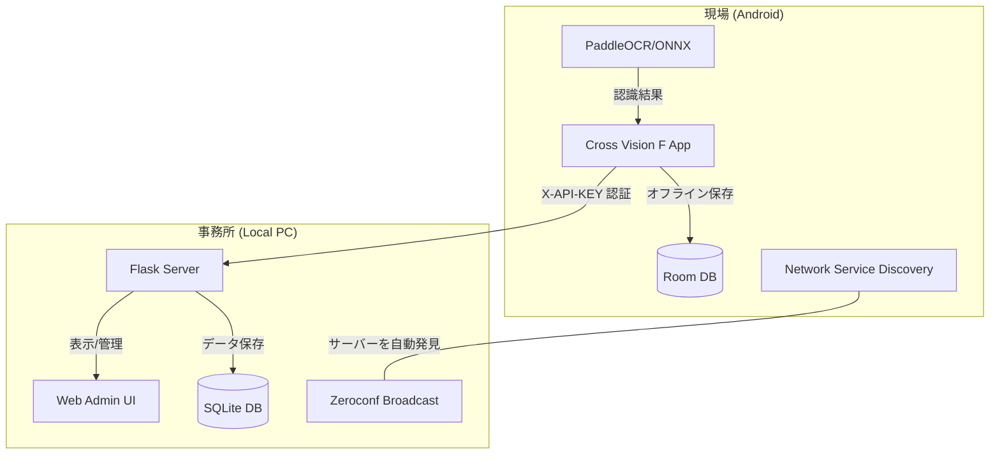

# Cross Vision F

**鉄骨工程管理 Android アプリケーション & PC 管理システム**

Cross Vision F は、鉄骨の工程管理を効率化するためのトータルソリューションです。
スマートフォンのカメラで鉄骨に手書きされた製品番号を撮影し、PaddleOCR (ONNX Runtime) による高速・高精度なオンデバイス認識を行います。
認識したデータは、同一 WiFi 内の PC サーバーへ**自動的に発見・接続**して同期され、一瞬で PC 側での管理・CSV 出力が可能になります。

---

## 主な機能

### 📸 高精度な OCR 読取 (PaddleOCR / ONNX)
PaddleOCR モデル（ONNX Runtime 動作）により、現場特有の手書き文字や反射のある鋼材表面でも高い認識精度を実現。1 回の撮影で複数の製品番号を同時に検出可能です。

### 📡 サーバー自動発見機能 (ZeroTouch Sync)
**mDNS (Multicast DNS)** を活用し、スマホがネットワーク上の PC サーバーを自動的に探し出します。
- **設定不要**: PC の IP アドレスが変更されても、アプリ側の設定を書き換える必要はありません。
- **自動接続**: 同一ネットワーク (WiFi) に入るだけで、同期準備が整います。

### 🛡️ セキュリティと認証 (API Key Auth)
ランダム生成された API キーによる認証を導入。
- **合言葉**: 無意味なランダム文字列（API キー）を知っている端末からのデータのみを受理します。
- **安全な同期**: 同じ WiFi 内の無関係な機器からの不正アクセスを防止します。

### 🖥️ PC 管理画面 (Flask Web UI)
Flask サーバーが提供する Web インターフェースにより、登録されたデータをリアルタイムに閲覧、工事・工程ごとのフィルタリング、管理用の CSV 出力が可能です。

### 📋 オフライン完全対応
電波の届かない現場内でも Room Database にデータを一旦保存。事務所の WiFi に接続したタイミングで「一括同期」を実行できます。

---

## システム構成



---

## 技術スタック

### Android アプリ
- **Kotlin** / **MVVM Architecture** / **Jetpack ViewBinding**
- **PaddleOCR (ONNX Runtime)**: 高精度オンデバイス文字認識
- **Retrofit2 / OkHttp3**: 認証ヘッダー付き HTTP クライアント
- **NsdManager**: ネットワークサービス自動発見
- **Room Database**: ローカルデータ永続化
- **WorkManager**: バックグラウンド同期タスク管理

### PC 管理サーバー
- **Python 3.x** / **Flask**: Web API サーバー
- **Zeroconf**: mDNS によるサービス情報配信
- **Flask-SQLAlchemy**: データベース ORM
- **SQLite3**: ローカル DB

---

## セットアップ

### 1. PC サーバー側 (Python / Flask)

#### ① 必要なライブラリのインストール (初回のみ)
```bash
cd server
pip install -r requirements.txt
```

#### ② サーバーの起動
```bash
python app.py
```
起動すると、`[*] 自動発見サービスを開始` というログが表示され、スマホからの接続待ち状態になります。

### 2. Android アプリ側

1. Android Studio でプロジェクトを開き、実機またはエミュレーターで起動します。
2. PC とスマホが同じ WiFi に接続されていることを確認します。
3. アプリ内の「同期」を実行すると、サーバーを自動で見つけ出し、未送信データを転送します。

---

## 今後の予定

- [x] OCR エンジンの PaddleOCR (ONNX) への換装
- [x] Flask サーバーによる実 API 同期の実装
- [x] PC 管理画面の構築と CSV 出力機能の実装
- [x] サーバーの自動発見機能 (mDNS) の実装
- [x] API キーによる認証機能の導入
- [ ] 工事・工程マスターデータのサーバー同期機能
- [ ] OCR で読み取った際のエビデンス写真のサーバー転送

---

## ライセンス / メンバー

本プロジェクトは社内開発用です。

**A Group**
- 曽我部 竹知世, 小野 航平, 上田 瑞樹, 礒野 虎太, 相良 謙介
