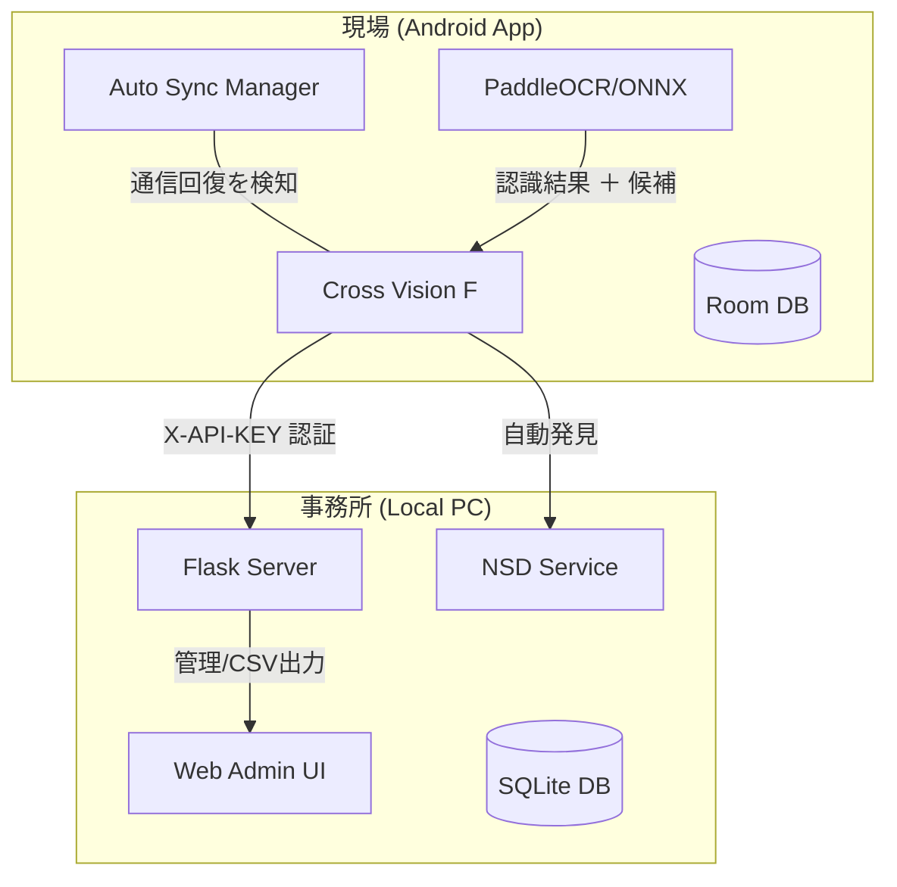

# Cross Vision F

**鉄骨工程管理 Android アプリケーション & PC 管理システム**

Cross Vision F は、鉄骨加工現場の工程管理をデジタル化し、データの正確性とリアルタイム性を極限まで高めたソリューションです。
自社開発のオンデバイス OCR と、ネットワーク環境に左右されない高度な同期システムを組み合わせ、現場での「記録」と事務所での「管理」をシームレスに繋ぎます。

---

## 🚀 主要機能

### 📝 オンデバイス OCR ＆ スマート候補選択
スマートフォンのカメラで製品番号をスキャン。デバイス内で完結するため、インターネット環境が不安定な現場でも瞬時に読み取ります。
- **画像プレビュー**: 確認画面で撮影画像を常時表示。文字と現物をその場で突き合わせ可能。
- **候補選択 (N-best candidates)**: AI が認識に迷った際、信頼度順に候補を提示。製品コードをタップするだけで候補リストからワンタップで修正できます。

### 📡 インテリジェント自動同期 (ZeroTouch Sync)
**mDNS (Multicast DNS)** と **WorkManager** を活用し、ユーザーが意識することなくデータをサーバーへ送り届けます。
- **ネットワーク検知型同期**: 履歴画面を開いている最中に通信が回復すると、自動的にサーバーを探索して未送信データを送信。
- **サーバー自動発見**: PC と WiFi が繋がれば、IP アドレスの設定なしで自動的に PC サーバーを発見・接続します。
- **オフライン完全対応**: 電波がない場所ではローカル DB (Room) に保存。繋がったタイミングでバックグラウンド送信します。

### 📋 現場最適化 UI (ver 2.0 準拠)
操作ミスを減らし、現場のスピードを落とさないための設計。
- **ワンタッチ操作**: 工程選択から登録まで、最小限のタップ数で完了。
- **状態の可視化**: 通信状態や同期の進捗をステータスバーで詳細に報告。
- **自動ナビゲーション**: 登録完了後は自動的にホーム画面に戻り、次の作業へスムーズに移行。

---

## 🛠️ システム構成



---

## 💻 技術スタック

### Android (Mobile)
- **Language**: Kotlin
- **Architecture**: MVVM + Jetpack ViewBinding
- **OCR Engine**: PaddleOCR (ONNX Runtime)
- **Sync**: WorkManager + ConnectivityManager (Callback)
- **Network**: Retrofit2 / OkHttp3 / NsdManager
- **Database**: Room Database

### Server (PC)
- **Framework**: Python / Flask
- **Discovery**: Zeroconf / mDNS
- **ORM/DB**: Flask-SQLAlchemy / SQLite3

---

## 🚀 セットアップと実行

### 1. 事務所側 (PC サーバー)
1. Python がインストールされていることを確認。
2. `server` ディレクトリで依存関係をインストール。
   ```bash
   pip install -r requirements.txt
   ```
3. サーバーを起動。
   ```bash
   python app.py
   ```

### 2. 現場側 (Android アプリ)
1. Android Studio でビルドし、実機へインストール。
2. PC と同じネットワーク (WiFi) に接続。
3. ログイン後、工程を選択して撮影を開始するだけで、データは自動的に PC へ同期されます。

---

## 📈 今後のロードマップ
- [x] OCR エンジンの ONNX 化による高速化
- [x] サーバーの自動発見・自動同期の実装
- [x] OCR エビデンス画像の表示機能
- [x] OCR 認識候補 (Candidate) のポップアップ選択
- [x] 通信回復時のバックグラウンド自動送信
- [ ] 工事・工程マスターデータのサーバー同期機能
- [ ] 画像解析による製品の「置き場」自動判定機能

---

## 👨‍💻 開発メンバー (Group A)
曽我部 竹知世, 小野 航平, 上田 瑞樹, 礒野 虎太, 相良 謙介
