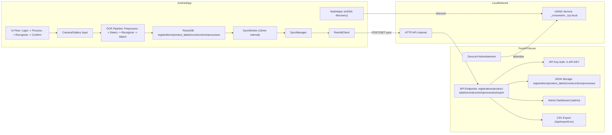

# CrossVision F

---

## 🆕 prototype_saitoOCR_ver1.6.1 — 変更点（2026-05-22）

### ver1.6 → ver1.6.1 変更点（BFS パラメータ修正）

> `OcrEngine.kt` の BFS パラメータ 2 点のみ変更。他は ver1.6 と完全同一。

#### OcrEngine.kt 変更

| パラメータ | ver1.5 / ver1.6 | **ver1.6.1** | 変更理由 |
|---|---|---|---|
| BFS `threshold` | 0.18f | **0.26f** | ver1.5 の低閾値は暗い環境向けで鉄骨刻印では誤検出増加 → ver1.4 の値に復元 |
| BFS `minPx` | 15 | **24** | 小さいノイズ領域が文字として検出されるのを防ぐため ver1.4 の値に復元 |

#### 変更の背景

- ver1.5 でBFS閾値を 0.26 → 0.18、minPx を 24 → 15 に変更したのは「液晶画面・チョーク文字・暗い環境」向けのチューニング
- 鉄骨刻印の認識（明るい屋外・打刻文字）には過剰で、錆・汚れ・背景テクスチャが文字として誤検出されていた
- 本バージョンで **ver1.4 と同じ BFS 設定に戻し精度を回復**

---

## 🆕 prototype_saitoOCR_ver1.6 — 変更点（2026-05-22）

### ver1.5 → ver1.6 変更点（斎藤案 OCR パラメータ更新）

> カメラ・UI は ver1.5 をそのまま継承。`OcrEngine.kt` の定数3点のみ変更。  
> 色モード機能（ColorMode）は精度が不十分なため **今回は含めない**。

#### OcrEngine.kt 定数変更

| 定数 | ver1.5 | **ver1.6（本ブランチ）** | 変更の目的 |
|---|---|---|---|
| `MAX_POLYGON_REGIONS` | 12 | **24** | BFS感度向上（0.26→0.18）により誤検出が減るため認識候補の上限を緩和 |
| `MAX_REC_WIDTH` | 512 px | **1920 px** | 高解像度の長い製品コードを切り捨てず正確に認識 |
| `expandPolygon` scale | 1.6f | **1.20f** | クロップ余白を適切化し隣接する別文字の混入を防止 |

#### 変更の概要

- **変更ファイル**：`OcrEngine.kt` のみ（1ファイル3行）
- カメラ・UI・`det.onnx`・認識モデルは **ver1.5 と完全同一**
- `MAX_REC_WIDTH` 拡大により、横に長い製品コード（例：20文字以上）の認識精度が向上
- `expandPolygon` を 1.6 → 1.20 に縮小することで隣接領域の文字混入リスクを低減

---

## 🆕 prototype_saitoOCR_ver1.5 — 変更点（2026-05-22）

### ver1.4 → ver1.5 変更点

#### カメラ・UI 修正

| 項目 | 内容 |
|---|---|
| リアルタイムOCR追尾 | カメラプレビュー映像に検出枠をリアルタイム表示する機能を追加（`detectOnly` モード）|
| カメラクロップ座標修正 | `PreviewView` の `FILL_CENTER` スケールを考慮した正確なクロップ座標変換に修正 |
| EXIF二重適用防止 | センサー回転角を動的に解決し、撮影画像が逆さまになるバグを修正 |
| アスペクト比統一 | 撮影画像の縦横方向の自動補正でクロップ精度を改善 |
| シャッター音無音化 | ガイド枠切り取りを廃止し、全体画像を保存する方式に変更 |
| プレビュー枠廃止 | `MaterialCardView` を `FrameLayout` に置き換えてカード枠を非表示化 |

#### OCR エンジン調整

| 項目 | ver1.4 | ver1.5 | 変更の目的 |
|---|---|---|---|
| BFS 閾値 | 0.26f | **0.18f** | 液晶画面・暗い環境での文字検出感度を向上 |
| BFS 最小px | 24 | **15** | 細い文字・手書きチョーク文字の検出漏れを抑制 |
| `expandPolygon` scale | 1.55f | **1.6f** | 文字周囲の余白をやや広く確保 |
| `runFullOcr` 引数 | なし | **`maxPolygons`, `detectOnly`** | リアルタイム追尾モードの切り替えに対応 |
| 処理解像度 | 従来 | **1600px** に引き上げ | OCR精度向上（特に細字・小文字） |

#### その他

- OCR エンジンのシングルトン化（ネイティブクラッシュ SIGSEGV 修正）
- `USER_GUIDE.md` を新規追加（ユーザー向け操作手順書）

---

## 🆕 prototype_saitoOCR_ver1.3 — 変更点（2026-05-15）

### ver1.2 → ver1.3 変更点

| 項目 | ver1.2（旧） | **ver1.3（本ブランチ）** | 変更の目的 |
|---|---|---|---|
| `det.onnx`（検出モデル） | 84.11 MB（INT8量子化・大型アーキテクチャ） | **4.60 MB（FP32・軽量アーキテクチャ）** | モデル構造を超軽量化して推論速度を大幅改善 |
| モデル層数 | 約1,141層（ResNet系バックボーン） | **約126層（MobileNet/LCNet系推定）** | パラメータ数を約9分の1に削減 |
| 量子化 | INT8量子化（DynamicQuantizeLinear） | **量子化なし（FP32）** | 軽量アーキテクチャのためそのままで高速 |
| `DET_SIZE`（DBNet入力サイズ） | 512 px | **512 px（変更なし）** | — |
| `OcrEngine.kt` コード変更 | — | **なし（モデルファイル置き換えのみ）** | 既存コードとの完全互換 |

#### 変更の概要

- **モデルファイルのみ置き換え**：`OcrEngine.kt` を含む全コードは ver1.2 と同一。
- **ファイルサイズ約18分の1**：84 MB → 4.6 MB。端末ストレージ・初回ロード時間を大幅削減。
- **層数約9分の1**：演算量が激減するため、DBNet 推論ステップがさらに高速化する見込み。
- **精度トレードオフ**：軽量モデルへの切り替えのため、認識精度は実機での検証が必要。

> **注意**: `DET_SIZE = 512` は ver1.2 から変更なし。  
> 新しい `det.onnx` も 512×512 入力対応モデルです。

---

鉄骨製品に刻印された製品番号を、Android端末のカメラ画像から認識して工程登録するシステムです。  
アプリはオフライン時にローカル保存し、オンライン復帰後にサーバーへ自動同期します。

## システム全体構成



## リポジトリ構成

```text
CrossVisionF/
├─ app/                      # Android アプリ本体
│  └─ src/main/java/com/crossvision/f/
│     ├─ ui/                 # 画面層 (login/process/recognize/confirm/library)
│     ├─ ocr/                # OCR 前処理・推論・照合
│     ├─ data/               # Room / Retrofit / Repository
│     └─ sync/               # WorkManager 同期・mDNS 検出
├─ server/                   # FastAPI サーバー + 管理画面
│  ├─ main.py                # API と mDNS 広告
│  ├─ dashboard.html         # 管理画面
│  └─ *.json                 # サーバー側データ永続化
└─ scripts/                  # 運用補助スクリプト
```

## Androidアプリ構成（詳細）

- **UI層**: `login` -> `process` -> `recognize` -> `confirm` の流れで登録操作を実行
- **OCR層**: `OcrEngine`, `OcrProcessor`, `ImagePreprocessor`, `LabelMatcher` による認識・照合
- **データ層**: Room (`AppDatabase`, `RegistrationDao`, `ProductLabelDao` など) と Retrofit (`ApiService`)
- **同期層**: `SyncWorker` が15分間隔で定期同期、`SyncManager` が送受信を実施
- **自動発見**: `NsdHelper` が `_crossvision._tcp` を探索してサーバー接続先を取得

## サーバー構成（詳細）

- **API**: FastAPI で登録データ受信、マスターデータ配信、CSV出力を提供
- **管理画面**: `GET /admin` でダッシュボードを表示
- **保存方式**: `registrations.json`, `product_labels.json`, `constructions.json`, `processes.json`
- **認証**: `X-API-KEY` ヘッダーを検証
- **自動発見**: Zeroconf で `_crossvision._tcp.local.` を広告

## クイックスタート（最短）

### 1) Androidアプリ起動

```bash
.\gradlew.bat installDebug
```

### 2) サーバー起動

```bash
cd server
pip install -r requirements.txt
python main.py
```

サーバー起動後の確認先:

- 管理画面: `http://localhost:5000/admin`
- ヘルスチェック: `http://localhost:5000/health`

## 詳細セットアップ

### 前提環境

- Android Studio (Hedgehog以降推奨)
- JDK 17+
- Python 3.10+
- ADB 利用可能な端末環境（実機テスト時）

### Androidビルド設定

- `compileSdk`: 35
- `minSdk`: 24
- `targetSdk`: 35
- Kotlin: 1.9.24
- AGP: 8.5.2

### サーバー依存関係

`server/requirements.txt` の内容:

- `fastapi==0.115.0`
- `uvicorn==0.32.0`
- `pydantic==2.9.0`
- `python-multipart==0.0.9`

`main.py` は `zeroconf` も利用するため、環境によっては追加インストールが必要です。

```bash
pip install zeroconf
```

### 運用補助スクリプト

- `scripts/install_all.ps1`: 接続中の全端末へ debug APK を配布
- `scripts/test_label_sync.ps1`: 同期処理を強制実行して logcat で確認

## OCR エンジン詳細（斎藤案 ver1.3 / 旧バージョンからの変更点）

### ver1.2 → ver1.3 変更点

READMEの冒頭セクション「🆕 prototype_saitoOCR_ver1.3」を参照してください。

---

### ver1.1 → ver1.2 変更点

| 項目 | ver1.1 | **ver1.2** | 変更の目的 |
|---|---|---|---|
| `DET_SIZE`（DBNet入力サイズ） | 640 px | **512 px** | ピクセル数 36% 削減 → DBNet 推論・BFS 処理が高速化 |
| `MAX_POLYGON_REGIONS`（最大検出領域数） | 24 | **12** | 処理時間の上限を半減・誤検出抑制 |
| `MAX_REC_WIDTH`（認識モデル入力幅上限） | 640 px | **512 px** | DET_SIZE 縮小に合わせてメモリ削減 |
| `det.onnx`（検出モデル） | 83.95 MB（640×640入力） | **84.11 MB（512×512入力）** | DET_SIZE 変更に対応した再学習済みモデル |
| `isUsefulCropForOcr` | なし | `sumLum` 変数を追加（積算のみ） | 将来の平均輝度チェック機能追加の準備 |

> **注意**: `DET_SIZE` と `det.onnx` は必ずセットで変更する必要があります。  
> 512×512 用モデルに 640×640 で入力すると検出精度が著しく低下します。

---

本ブランチで採用している OCR エンジン（`OcrEngine.kt`）の処理フローと各ステップの解説です。

### 処理フロー全体

```
[カメラ / ギャラリー画像]
        │
        ▼
① 512×512 リサイズ（createDetectionInputBitmap）
        │  DBNet は 512×512 固定入力を想定（ver1.2 で 640 → 512 に変更）
        ▼
② コントラスト強調（enhanceContrastForDetection）
        │  輝度レンジを線形ストレッチ（scale ≤ 2.2, bias +8）
        ▼
③ DBNet 推論（runDetectionModel）
        │  各ピクセルが文字領域かの確率マップ [640×640] を生成
        ▼
④ BFS 連結成分抽出（bfsComponents）
        │  閾値 0.26 以上のピクセルを幅優先探索で塊に分割
        ▼
⑤ PCA 最小外接矩形（pcaMinRect）
        │  各塊の主軸を主成分分析で推定 → 傾いた矩形（RotatedRect）
        ▼
⑥ UNCLIP 領域拡張（unclipRect）
        │  矩形を sqrt(1.5) 倍に拡張して文字端の切れを防ぐ
        ▼
⑦ 座標スケール変換・面積フィルタ（detectTextPolygons）
        │  640×640 → 元画像座標へ変換、面積 < 120px² を除外
        │  面積が大きい順に上位 24 件のみ処理
        ▼
⑧ ポリゴン拡張 1.55 倍（expandPolygon）
        │  重心から各頂点を 1.55 倍に広げる（文字余白を確保）
        ▼
⑨ 射影変換クロップ（safePerspectiveCrop）
        │  4 頂点→正面向きの長方形に変換（Matrix.setPolyToPoly）
        │  例外時はバウンディングボックスでフォールバック
        ▼
⑩ 画質フィルタ（isUsefulCropForOcr）
        │  真っ白・情報量ゼロのクロップを早期スキップ
        ▼
⑪ 縦長正規化（normalizeToHorizontal）
        │  height > width × 1.2 なら 90° 回転して横向きに統一
        ▼
⑫ 向き比較認識（recognizeBestOrientationWithTiming）
        │  0° で認識 → 十分な信頼度なら早期終了
        │  不足なら 180° でも認識してスコアで比較・採用
        ▼
⑬ 認識後テキストフィルタ（isUsefulOcrResult）
        │  空文字・記号のみ・低品質な結果を除外
        ▼
[OcrDetectionItem リストとして返却]
```

---

### ① コントラスト強調の仕組み

DBNet がテキスト境界を検出しやすくするため、入力画像のコントラストを強調する。

```
全ピクセルの輝度 L = 0.299R + 0.587G + 0.114B を計算
  range = maxL - minL
  range < 12f → コントラスト差が小さすぎるためスキップ（無変更で返す）
  scale = min(220 / range, 2.2)  ← 上限 2.2 倍で白飛び防止
  bias  = -minL × scale + 8      ← 暗部を微量底上げ（+8 定数）
  出力ピクセル = scale × 入力 + bias（ColorMatrix で GPU 処理）
```

| パラメータ | 値 | 説明 |
|---|---|---|
| スキップ閾値 | `12f` | 輝度レンジがこれ未満なら補正不要と判断 |
| scale 上限 | `2.2f` | 引き伸ばしすぎによる白飛び・ノイズ増幅を防ぐ |
| bias | `+8f` | 黒つぶれしやすい暗い画像を全体的に持ち上げる |

---

### ② DBNet 入力正規化（ImageNet 標準化）

DBNet モデルは ImageNet で事前学習されているため、同じ正規化を適用する。

```
正規化式: normalized = (pixel / 255.0 - mean) / std
  mean = 0.485（全チャネル共通・簡略化）
  std  = 0.229（全チャネル共通・簡略化）
入力テンソル形状: [1, 3, 512, 512]（NCHW 形式 / チャネル優先）  ← ver1.2 で 640→512
```

> 厳密には ImageNet の mean/std はチャネルごとに異なる（R:0.485/0.229, G:0.456/0.224, B:0.406/0.225）が、本実装では全チャネルに R の値を使用している（簡略化）。

---

### ③ BFS 連結成分抽出のパラメータ

| パラメータ | 値 | 意味 |
|---|---|---|
| `threshold` | `0.26f` | この値より大きいピクセルを「文字の可能性あり」として扱う |
| `minPx` | `24` | 連結成分として認める最小ピクセル数（これ未満はノイズとして除外） |
| 最大領域数 | `12`（ver1.1 は 24） | 面積が大きい順に上位 12 件のみ処理（処理時間の上限を設ける）|
| 最小面積 | `120px²` | 極小のゴミ領域を除外（BFS 後の追加フィルタ） |

---

### ④ PCA で傾いた矩形を推定する原理

DBNet の出力は「確率の高いピクセルの塊」であり、文字が傾いている場合は
軸平行な矩形では文字端が切れてしまう。PCA（主成分分析）を使って傾きを推定する。

```
1. 連結成分の重心（cx, cy）を計算
2. 共分散行列 [[cxx, cxy], [cxy, cyy]] を計算
3. 固有値の解析解で主軸の傾き angle を求める
4. 主軸方向に射影して min/max から矩形の幅 w・高さ h を決定
```

> UNCLIP 後に `expandPolygon(scale=1.55)` でさらに拡大することで、
> 文字周囲に十分な余白を確保して認識精度を向上させている。

---

### ⑤ 向き比較認識（0° vs 180°）のフロー

```
┌─────────────────────────────┐
│ 正規化済みクロップ（横向き）    │
└────────────┬────────────────┘
             │ 0° で認識
             ▼
   isConfidentNormalResult?
   ┌── YES（信頼度 ≥ 0.62 かつ有効文字率 ≥ 0.75 かつ有効文字数 ≥ 4）
   │         → 0° の結果を即採用（180° 推論をスキップ）
   └── NO
             │ 180° 回転して認識
             ▼
   recognitionScore(180°) > recognitionScore(0°)?
   ┌── YES → 180° の結果を採用
   └── NO  → 0° の結果を採用
```

**認識スコアの計算式:**

```kotlin
score = confidence × 0.80          // 信頼度（重み 80%）
      + usefulRatio × 0.15         // 有効文字率（英数字・-・/ の割合）（重み 15%）
      + min(textLength, 24) × 0.002 // 文字数ボーナス（上限 24 文字）
```

> 信頼度だけで判定すると「短い誤認識が高スコアになりやすい」問題がある。
> 有効文字率と文字数ボーナスを加えることでこの問題を緩和している。

---

### ⑥ SVTR 認識モデルの入力形式

```
入力テンソル形状: [1, 3, 48, W]（W は 32 の倍数、最大 640）
正規化: (pixel / 127.5) - 1.0  → [-1, 1] に変換
  ※ 検出モデルの [0,1] 正規化（/255）とは異なる点に注意

幅の計算:
  aspect = bitmap.width / bitmap.height
  rawW   = REC_HEIGHT(48) × aspect
  W      = ceil(rawW / 32) × 32（32 の倍数に切り上げ）
  W      = clamp(W, 32, 640)
```

---

### ⑦ 画質フィルタ（isUsefulCropForOcr）の除外条件

長辺を最大 128px に縮小してから統計を計算し（処理速度優先）、以下の条件に該当する場合は認識をスキップする。

| 除外条件 | 判定式 | 除外対象の例 |
|---|---|---|
| ほぼ真っ白 | `brightRatio>0.96 && darkRatio<0.002 && coloredRatio<0.002 && contrast<35` | 背景の白壁・空白領域 |
| 色も輪郭もない | `coloredRatio<0.002 && edgeRatio<0.003 && contrast<45` | 一様な錆面・コンクリート壁 |
| 絶対数が少なすぎる | `coloredCount<2 && edgeLikeCount<3 && contrast<35` | 極小ノイズ領域 |

> `coloredCount`: 彩度 > 0.18 かつ明度 > 0.16 のピクセル数（黄色マーキングなどを検出）  
> `edgeLikeCount`: 輝度 < 110 のピクセル数（黒文字や暗い線の近似）

---

### ⑧ 認識後フィルタ（isUsefulOcrResult）の除外条件

| 除外条件 | 判定式 | 除外対象の例 |
|---|---|---|
| テキストが空 | `text.isEmpty()` | 認識失敗 |
| エラー出力 | `upper == "EMPTY" or "FORMATERR" or "ERROR"` | モデルのエラートークン |
| 有効文字が皆無 | `usefulCount == 0` | 記号のみ（`@#%!` など） |
| 有効文字率が低い | `usefulRatio < 0.45` | 記号混じりのゴミ認識 |
| 短い低信頼認識 | `usefulCount ≤ 2 && confidence < 0.60` | 偶然一致した 1〜2 文字 |

> `usefulCount`: 英数字・`-`・`/` の文字数（製品コードに使われる文字種）

---

### 処理時間の目安と OcrTiming の見方

`OcrOutput.timing` で各ステップの処理時間（ms）を確認できる。

| フィールド | 内容 |
|---|---|
| `totalMs` | 全体の処理時間 |
| `detectionMs` | 検出フェーズ全体（前処理 + DBNet + 後処理） |
| `detectionPreprocessMs` | リサイズ + コントラスト補正 |
| `detectionModelAndPostprocessMs` | DBNet 推論 + BFS/PCA/UNCLIP |
| `normalRecognitionMs` | 0° 認識の累積時間 |
| `rotatedRecognitionMs` | 180° 認識の累積時間（早期終了で短縮可） |
| `cropMs` | パースペクティブクロップの累積時間 |
| `cropCheckMs` | 画質フィルタの累積時間 |
| `normalRecognitionCount` | 0° 認識を実行した領域数 |
| `rotatedRecognitionCount` | 180° 認識まで実行した領域数（早期終了しなかった数） |

---

## API・同期・データフロー

### 主要API

- `POST /api/registrations`
- `GET /api/registrations`
- `GET /api/product-labels`
- `GET /api/constructions`
- `GET /api/processes`
- `GET /api/export/csv`

### 同期の流れ

1. ユーザーが認識結果を登録
2. 端末側 Room に保存（オフライン可）
3. `SyncWorker` が定期実行（15分）
4. `SyncManager` がサーバーへ未送信分を送信
5. 必要に応じて製品ラベルなどのマスターを更新

## 設定値一覧

| 項目 | 現在値 | 定義箇所 |
|---|---|---|
| Android package (debug) | `com.crossvision.f.debug` | `app/build.gradle.kts` |
| Server port | `5000` | `server/main.py` |
| API header | `X-API-KEY` | `server/main.py`, `RetrofitClient.kt` |
| API key value | `cvf_7s_9922_zrkp_8x11` | `server/main.py`, `RetrofitClient.kt` |
| mDNS service type | `_crossvision._tcp.local.` | `server/main.py`, `NsdHelper.kt` |
| Sync interval | `15 minutes` | `SyncWorker.kt` |

## セキュリティ注意事項（現状）と改善TODO

### 現状

- APIキーがクライアント/サーバー双方に固定文字列で実装されています
- Androidアプリは `usesCleartextTraffic=true` で平文HTTP通信を許可しています
- 環境変数や `.env` ベースの設定分離は未導入です

### 改善TODO（推奨）

1. APIキーをハードコードから除去し、環境変数または安全な設定配布へ移行
2. 開発環境以外はHTTPS化し、クリアテキスト通信を無効化
3. シークレット値のローテーション手順を運用手順に追加
4. 認証方式の強化（期限付きトークンなど）の検討

## テスト・検証手順

### Android

```bash
.\gradlew.bat test
.\gradlew.bat connectedAndroidTest
```

### 同期確認

```powershell
.\scripts\test_label_sync.ps1
```

### 配布確認

```powershell
.\scripts\install_all.ps1
```

## トラブルシューティング

- **サーバー起動時に `zeroconf` が無いと言われる**  
  `pip install zeroconf` を実行して再起動してください。
- **Android端末が `adb devices` に出ない**  
  USBデバッグ有効化とドライバー導入を確認してください。
- **同期されない**  
  端末とサーバーが同一ネットワークにいるか、サーバーが5000番で起動しているかを確認してください。
- **管理画面が開かない**  
  `http://localhost:5000/admin` へアクセスし、サーバープロセス稼働を確認してください。

## コントリビュート

1. 機能追加や修正はトピックブランチで作業
2. 変更内容と検証結果をPull Requestに記載
3. 影響範囲が大きい変更はREADMEまたは関連ドキュメントも更新

コミットメッセージ例:

- `feat: ...`
- `fix: ...`
- `docs: ...`
- `refactor: ...`

## ライセンス

現在このリポジトリには `LICENSE` ファイルがありません。  
運用時はプロジェクト方針に合わせてライセンスを追加してください。
