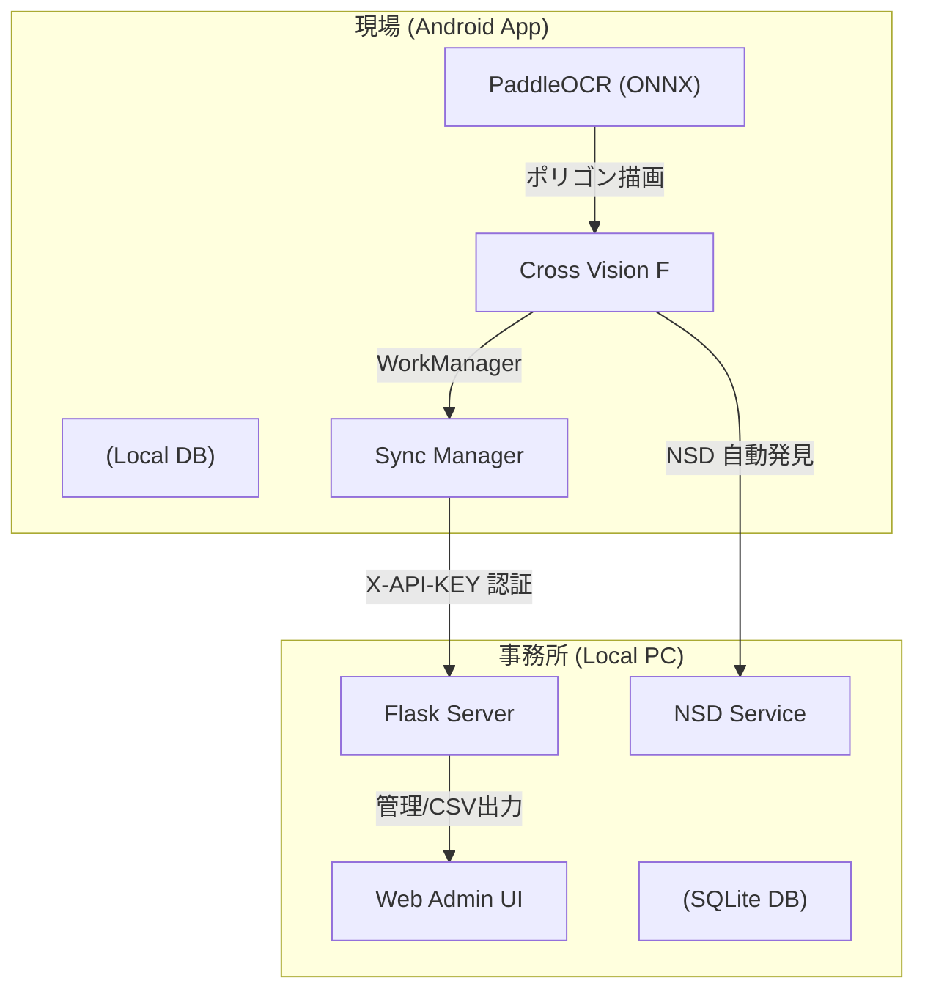

# Cross Vision F

**鉄骨工程管理 Android アプリケーション & PC サーバーシステム**

Cross Vision F は、鉄骨加工現場の工程管理をデジタル化し、データの正確性とリアルタイム性を極限まで高めたソリューションです。
自社開発のオンデバイス OCR（PaddleOCR 改良版）と、ネットワーク環境に左右されない高度な同期システムを組み合わせ、現場での「記録」と事務所での「管理」をシームレスに繋ぎます。

---

## 🚀 主要機能

### 📝 オンデバイス OCR ＆ 視覚的フィードバック
スマートフォンのカメラで製品番号をスキャン。デバイス内で完結するため、インターネット環境が不安定な現場でも瞬時に読み取ります。
- **オーバーレイ表示**: 認識した文字の領域を画像上にポリゴン（多角形）で描画。
- **信頼度別色分け**: 精度に応じて 緑（高）、黄（中）、赤（低）で色分け表示し、確認ミスを防止。
- **上下逆さま認識**: 鉄骨の向きに関わらず、180度回転した状態でも自動判定して正しく認識。

### 📡 インテリジェント自動同期 (ZeroTouch Sync)
**mDNS (Multicast DNS)** と **WorkManager** を活用し、ユーザーが意識することなくデータをサーバーへ送り届けます。
- **サーバー自動発見 (NSD)**: PC と WiFi が繋がれば、IP アドレスの設定なしで自動的に PC サーバーを発見・接続します。
- **バックグラウンド自動送信**: 15分間隔で未送信データをチェックし、通信回復時に自動で送信を実行。
- **詳細ステータス報告**: 送信時、単なる成否だけでなく「サーバー接続中」「サーバー不在のため予約」など、現在の状況を正確にユーザーへ伝えます。

### 📋 現場最適化 UI
操作ミスを減らし、スピードを落とさないための作業員向け設計。
- **カテゴリ切替**: 製品と部品をワンステップで切り替え。
- **動的候補リスト**: 認識結果が曖昧な場合、マスターデータから近い候補を提示し、タップ操作で修正が可能。

---

## 🛠️ システム構成



---

## 📸 文字認識技術の詳細

本アプリが採用している AI 文字認識（OCR）の処理フローと、各ステップで用いている技術を解説します。

### 1. テキスト領域検出 (DBNet)
**DBNet (Differentiable Binarization Network)** を採用。
- **アルゴリズム**: ニューラルネットワークが各ピクセルの「文字らしさ」を確率マップとして出力。
- **多角形抽出**: 単なる四角形ではなく、斜めや歪みに強い多角形（ポリゴン）として領域を特定。
- **Perspective Crop**: 検出した多角形の頂点を射影変換で長方形に補正し、認識モデルへ渡すことで精度を最大化。

### 2. 文字認識 (SVTR)
**SVTR (Single Visual model for scene Text Recognition)** を採用。
- **180度回転対応**: 各領域に対して「正立」と「180度回転」の両パターンを並列で認識し、マスターデータに近い方を自動採用。鉄骨の置かれ方に左右されない認識を実現。

### 3. ラベルマッチング（Levenshtein 距離）
認識したテキストを以下のルールで評価・分類します。
- **編集距離 (Levenshtein Distance)**: 1文字の追加・削除・置換にかかるコストを計算。
- **バリアント生成**: 刻印で混同しやすいペア（0 と O、1 と I、8 と B など）を自動正規化。
- **分類**:
  - **編集距離 ≤ 3**: 「登録候補」として上位表示。
  - **編集距離 ≥ 4**: 「参考情報」として別枠に表示。

---

## 💻 動作確認済み環境

| 項目 | バージョン / 内容 |
| :--- | :--- |
| **Android OS** | API 24 (7.0) 以上、推奨 API 33 以上 |
| **Android Studio** | Koala / Ladybug 以降推奨 |
| **Kotlin** | 1.9.24 |
| **OCR Models** | PP-OCRv4 (det.onnx / rec.onnx) |
| **PC Server** | Python 3.10+ / Flask 3.1.3 |

---

## 🚀 セットアップ手順

### 1. リポジトリの取得
```bash
git clone https://github.com/iput04-isono/Solution.git
cd Solution
```

### 2. PC サーバーの起動
`server` ディレクトリに移動し、サーバーを起動します。
```bash
pip install -r requirements.txt
python app.py
```
※ サーバーが起動すると、ネットワーク内で `SevenStarServer` という名称で自動広告が開始されます。

### 3. Android アプリの実行
1. Android Studio でプロジェクトを開き、Gradle 同期を完了させます。
2. Android 実機を接続し、USB デバッグを有効にします。
3.  ボタンでインストール。
4. PC と同じ WiFi に接続していれば、設定不要でサーバーを自動認識します。

---

## 👨‍💻 開発メンバー (Group A)
曽我部 竹知世, 小野 航平, 上田 瑞樹, 礒野 虎太, 相良 謙介
