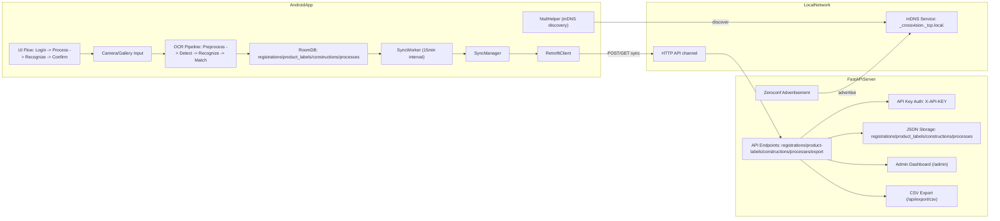

# CrossVision F

鉄骨製品に刻印された製品番号を、Android端末のカメラ画像から認識して工程登録するシステムです。  
アプリはオフライン時にローカル保存し、オンライン復帰後にサーバーへ自動同期します。

## システム全体構成



## リポジトリ構成

```text
CrossVisionF/
├─ app/                      # Android アプリ本体
│  └─ src/main/java/com/crossvision/f/
│     ├─ ui/                 # 画面層 (login/process/recognize/confirm/library)
│     ├─ ocr/                # OCR 前処理・推論・照合
│     ├─ data/               # Room / Retrofit / Repository
│     └─ sync/               # WorkManager 同期・mDNS 検出
├─ server/                   # FastAPI サーバー + 管理画面
│  ├─ main.py                # API と mDNS 広告
│  ├─ dashboard.html         # 管理画面
│  └─ *.json                 # サーバー側データ永続化
└─ scripts/                  # 運用補助スクリプト
```

## Androidアプリ構成（詳細）

- **UI層**: `login` -> `process` -> `recognize` -> `confirm` の流れで登録操作を実行
- **OCR層**: `OcrEngine`, `OcrProcessor`, `ImagePreprocessor`, `LabelMatcher` による認識・照合
- **データ層**: Room (`AppDatabase`, `RegistrationDao`, `ProductLabelDao` など) と Retrofit (`ApiService`)
- **同期層**: `SyncWorker` が15分間隔で定期同期、`SyncManager` が送受信を実施
- **自動発見**: `NsdHelper` が `_crossvision._tcp` を探索してサーバー接続先を取得

## サーバー構成（詳細）

- **API**: FastAPI で登録データ受信、マスターデータ配信、CSV出力を提供
- **管理画面**: `GET /admin` でダッシュボードを表示
- **保存方式**: `registrations.json`, `product_labels.json`, `constructions.json`, `processes.json`
- **認証**: `X-API-KEY` ヘッダーを検証
- **自動発見**: Zeroconf で `_crossvision._tcp.local.` を広告

## クイックスタート（最短）

### 1) Androidアプリ起動

```bash
.\gradlew.bat installDebug
```

### 2) サーバー起動

```bash
cd server
pip install -r requirements.txt
python main.py
```

サーバー起動後の確認先:

- 管理画面: `http://localhost:5000/admin`
- ヘルスチェック: `http://localhost:5000/health`

## 詳細セットアップ

### 前提環境

- Android Studio (Hedgehog以降推奨)
- JDK 17+
- Python 3.10+
- ADB 利用可能な端末環境（実機テスト時）

### Androidビルド設定

- `compileSdk`: 35
- `minSdk`: 24
- `targetSdk`: 35
- Kotlin: 1.9.24
- AGP: 8.5.2

### サーバー依存関係

`server/requirements.txt` の内容:

- `fastapi==0.115.0`
- `uvicorn==0.32.0`
- `pydantic==2.9.0`
- `python-multipart==0.0.9`

`main.py` は `zeroconf` も利用するため、環境によっては追加インストールが必要です。

```bash
pip install zeroconf
```

### 運用補助スクリプト

- `scripts/install_all.ps1`: 接続中の全端末へ debug APK を配布
- `scripts/test_label_sync.ps1`: 同期処理を強制実行して logcat で確認

## API・同期・データフロー

### 主要API

- `POST /api/registrations`
- `GET /api/registrations`
- `GET /api/product-labels`
- `GET /api/constructions`
- `GET /api/processes`
- `GET /api/export/csv`

### 同期の流れ

1. ユーザーが認識結果を登録
2. 端末側 Room に保存（オフライン可）
3. `SyncWorker` が定期実行（15分）
4. `SyncManager` がサーバーへ未送信分を送信
5. 必要に応じて製品ラベルなどのマスターを更新

## 設定値一覧

| 項目 | 現在値 | 定義箇所 |
|---|---|---|
| Android package (debug) | `com.crossvision.f.debug` | `app/build.gradle.kts` |
| Server port | `5000` | `server/main.py` |
| API header | `X-API-KEY` | `server/main.py`, `RetrofitClient.kt` |
| API key value | `cvf_7s_9922_zrkp_8x11` | `server/main.py`, `RetrofitClient.kt` |
| mDNS service type | `_crossvision._tcp.local.` | `server/main.py`, `NsdHelper.kt` |
| Sync interval | `15 minutes` | `SyncWorker.kt` |

## セキュリティ注意事項（現状）と改善TODO

### 現状

- APIキーがクライアント/サーバー双方に固定文字列で実装されています
- Androidアプリは `usesCleartextTraffic=true` で平文HTTP通信を許可しています
- 環境変数や `.env` ベースの設定分離は未導入です

### 改善TODO（推奨）

1. APIキーをハードコードから除去し、環境変数または安全な設定配布へ移行
2. 開発環境以外はHTTPS化し、クリアテキスト通信を無効化
3. シークレット値のローテーション手順を運用手順に追加
4. 認証方式の強化（期限付きトークンなど）の検討

## テスト・検証手順

### Android

```bash
.\gradlew.bat test
.\gradlew.bat connectedAndroidTest
```

### 同期確認

```powershell
.\scripts\test_label_sync.ps1
```

### 配布確認

```powershell
.\scripts\install_all.ps1
```

## トラブルシューティング

- **サーバー起動時に `zeroconf` が無いと言われる**  
  `pip install zeroconf` を実行して再起動してください。
- **Android端末が `adb devices` に出ない**  
  USBデバッグ有効化とドライバー導入を確認してください。
- **同期されない**  
  端末とサーバーが同一ネットワークにいるか、サーバーが5000番で起動しているかを確認してください。
- **管理画面が開かない**  
  `http://localhost:5000/admin` へアクセスし、サーバープロセス稼働を確認してください。

## コントリビュート

1. 機能追加や修正はトピックブランチで作業
2. 変更内容と検証結果をPull Requestに記載
3. 影響範囲が大きい変更はREADMEまたは関連ドキュメントも更新

コミットメッセージ例:

- `feat: ...`
- `fix: ...`
- `docs: ...`
- `refactor: ...`

## ライセンス

現在このリポジトリには `LICENSE` ファイルがありません。  
運用時はプロジェクト方針に合わせてライセンスを追加してください。
