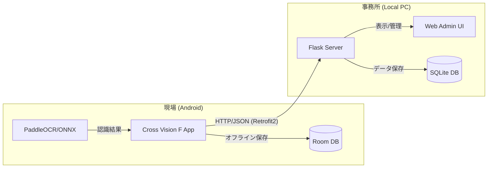

# Cross Vision F

**鉄骨工程管理 Android アプリケーション & PC 管理システム**

Cross Vision F は、鉄骨の工程管理を効率化するためのトータルソリューションです。
スマートフォンのカメラで鉄骨に手書きされた製品番号を撮影し、PaddleOCR (ONNX Runtime) による高速・高精度なオンデバイス認識を行います。
認識したデータは同一 LAN 内のローカル PC（Flask サーバー）へリアルタイムに同期され、PC のブラウザから一括管理・CSV 出力が可能です。

---

## 主な機能

### 📸 高精度な OCR 読取 (PaddleOCR / ONNX)
Google ML Kit から PaddleOCR モデル（ONNX Runtime 動作）へ換装し、手書き文字の認識精度を大幅に向上させました。1 回の撮影で複数の製品番号を同時に検出し、現場での修正も容易です。

### 📡 ローカル PC 同期 (Real-time Sync)
現場のローカル PC に設置した管理サーバーへデータを自動送信します。Retrofit2 を使用した堅牢な通信により、オフラインから復帰した際の一括送信にも対応しています。

### 🖥️ PC 管理画面 (Flask Web UI)
Flask サーバーが提供する Web インターフェースにより、登録されたデータをリアルタイムに閲覧、工事・工程ごとのフィルタリング、管理用の CSV 出力が可能です。

### 📋 登録履歴とオフライン対応
電波の届かない場所でも端末内の Room Database にデータを一旦保存。WorkManager を使用して、ネットワーク復帰時に自動的にバックグラウンド同期を行います。

---

## システム構成



---

## 技術スタック

### Android アプリ
- **Kotlin** / **MVVM Architecture** / **Jetpack ViewBinding**
- **PaddleOCR (ONNX Runtime)**: 高精度オンデバイス文字認識
- **Retrofit2 / OkHttp3**: サーバー同期用 HTTP クライアント
- **Room Database**: ローカルデータ永続化
- **WorkManager**: バックグラウンド同期タスク管理
- **CameraX**: 高速・安定したカメラプレビュー・撮影

### PC 管理サーバー
- **Python 3.x** / **Flask**: 軽量 Web API サーバー
- **Flask-SQLAlchemy**: データベース ORM
- **SQLite3**: ローカル DB
- **Bootstrap 5**: 管理画面フロントエンド

---

## セットアップ

### 1. PC サーバー側 (Python) の起動

1. Python がインストールされていることを確認
2. サーバーディレクトリへ移動し、ライブラリをインストール
   ```bash
   cd server
   pip install -r requirements.txt
   ```
3. サーバーを起動
   ```bash
   python app.py
   ```
   - 管理画面: `http://localhost:5000/admin`
   - API 端点: `http://[PCのIP]:5000/api/registrations`

### 2. Android アプリ側の設定

1. `app/src/main/java/com/crossvision/f/data/api/RetrofitClient.kt` を開きます。
2. `serverBaseUrl` を PC の IPv4 アドレス（`ipconfig` 等で確認）に書き換えてください。
   ```kotlin
   var serverBaseUrl: String = "http://192.168.x.x:5000" // PCのIP
   ```
3. Android Studio でプロジェクトをビルド・実行してください。

---

## プロジェクト構成

```
.
├── app/src/main/java/com/crossvision/f/
│   ├── ui/             # 画面（Activity / ViewModel / Adapter）
│   ├── data/           # データ層
│   │   ├── api/        # Retrofit 通信 (NEW)
│   │   ├── local/      # Room Database
│   │   └── model/      # データモデル / API 定義
│   ├── ocr/            # PaddleOCR (ONNX) 関連
│   └── sync/           # オフライン同期・API 通信制御
├── server/             # PC 管理サーバー
│   ├── app.py          # Flask サーバー本体
│   ├── templates/      # 管理画面 HTML (Jinja2)
│   └── requirements.txt
└── gradle/             # ビルド設定
```

---

## 今後の予定

- [x] OCR エンジンの PaddleOCR (ONNX) への換装
- [x] Flask サーバーによる実 API 同期の実装
- [x] PC 管理画面の構築と CSV 出力機能の実装
- [ ] サーバー側でのユーザー認証 (OAuth/JWT) の導入
- [ ] 工事・工程マスターデータのサーバー同期機能
- [ ] OCR で読み取った際のエビデンス写真のサーバー転送

---

## ライセンス / メンバー

本プロジェクトは社内開発用です。

**A Group**
- 曽我部 竹知世, 小野 航平, 上田 瑞樹, 礒野 虎太, 相良 謙介
